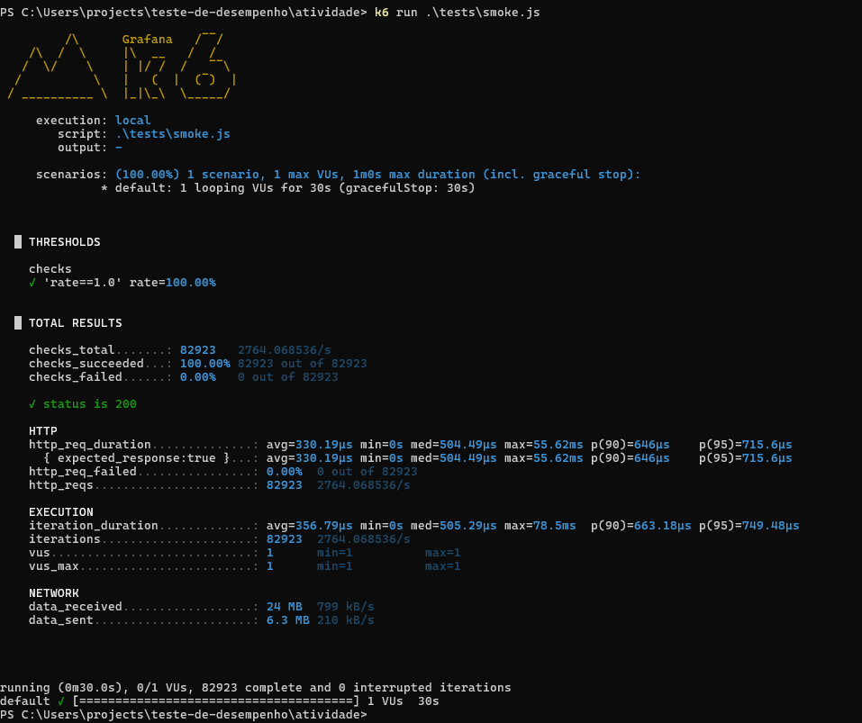
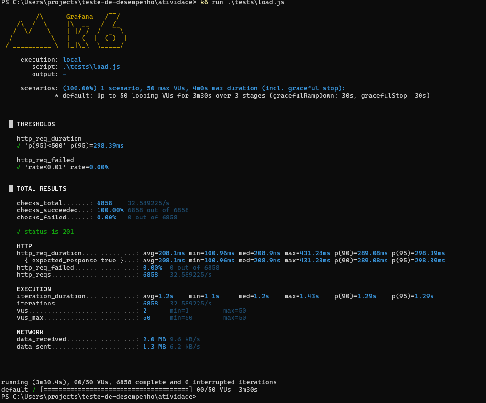
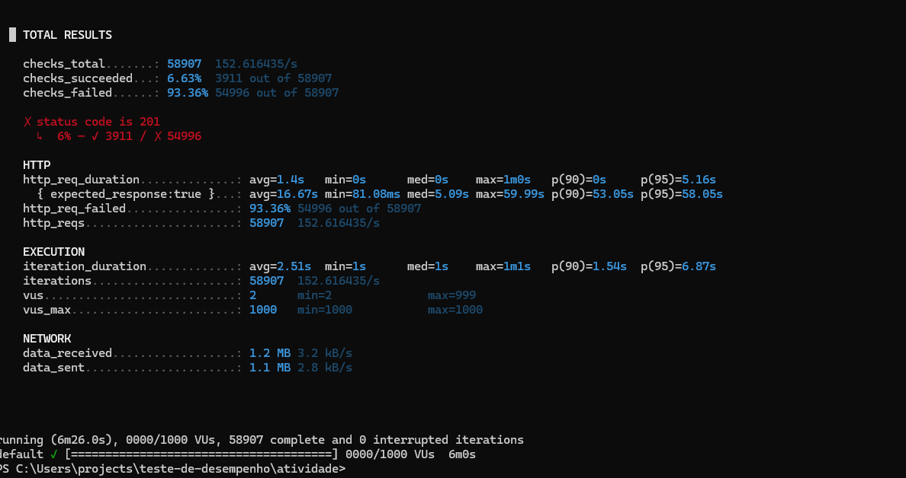
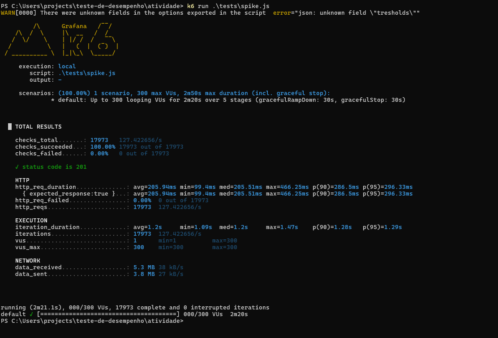

# Relatório de Teste de Desempenho - API de Checkout

**Data:** 23 de Novembro de 2025
**Ferramenta:** k6
**Sistema Alvo (SUT):** API de Checkout Simulada

---

### Resumo Executivo

Os testes de desempenho executados na API de Checkout revelaram capacidades distintas para os diferentes cenários de carga.

*   **Capacidade Máxima (I/O Bound - `/checkout/simple`):** A API demonstrou alta resiliência, suportando picos de **pelo menos 300 usuários simultâneos** sem apresentar falhas ou degradação significativa na performance. O tempo de resposta (p95) manteve-se abaixo de 300ms, indicando que a capacidade máxima real é provavelmente superior a 300 usuários.

*   **Capacidade Máxima (CPU Bound - `/checkout/crypto`):** A API mostrou-se extremamente sensível a operações de uso intensivo de CPU. O sistema começou a apresentar falhas com aproximadamente 85 usuários simultâneos e entrou em colapso total à medida que a carga aumentava, resultando em uma taxa de falha superior a 93%. A capacidade máxima para este cenário é, portanto, inferior a 100 usuários.

---

### Análise de Estresse (`/checkout/crypto`)

O teste de estresse foi projetado para identificar o ponto de ruptura da aplicação sob carga intensiva de CPU. A análise dos resultados e da execução em tempo real indicou que a aplicação começou a falhar (recusando conexões) quando a carga atingiu aproximadamente 85 usuários virtuais (VUs). A partir deste ponto, os tempos de resposta aumentaram drasticamente e a taxa de erro cresceu exponencialmente, caracterizando o limite operacional do sistema para esta rota.

---

### Evidências (Resultados dos Testes)

**1. Smoke Test (`/health`)**

**2. Load Test (`/checkout/simple`)**

**3. Stress Test (`/checkout/crypto`)**

**4. Spike Test (`/checkout/simple`)**
